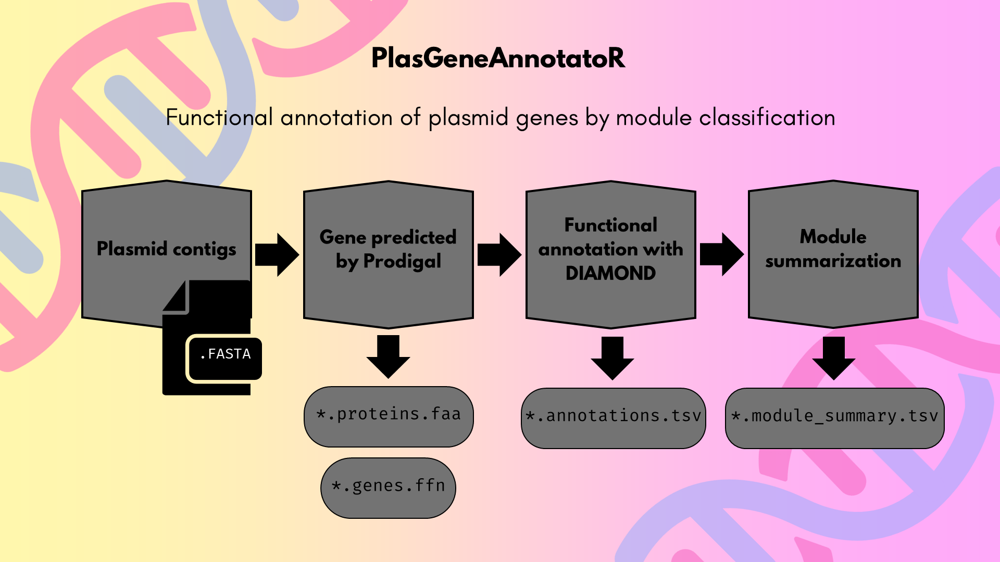

<p align="center">
  
</p>

# PlasGeneAnnotatoR

**PlasGeneAnnotatoR** is a bioinformatics tool for the functional annotation of genes in plasmid contigs.  
It predicts genes using **Prodigal**, and classifies them into functional modules (replication, mobility, stability, and adaptation) through fast similarity searches with **DIAMOND** against a curated reference database.

---

## Requirements

- Python 3.8+
- [DIAMOND](https://github.com/bbuchfink/diamond)
- [Prodigal](https://github.com/hyattpd/Prodigal)
- Biopython
- pandas
- gdown (for database download)

---

## Installation

1. Clone the repository:
```bash
git clone https://github.com/HaydeSaracho/PlasGeneAnnotatoR.git
cd PlasGeneAnnotatoR
```

2. Create and activate a virtual environment (optional but recommended):
```bash
python -m venv env
.\env\Scripts\activate      # On Windows
source env/bin/activate     # On Linux/Mac
```

3. Install dependencies:
```bash
pip install -r requirements.txt
```

> **Note:** 
Make sure you have DIAMOND and Prodigal installed and available in your $PATH.

4. Downloading the Reference Database
```bash
python src/PlasGeneAnnotatoR_db.py
```
---

## Usage
PlasGeneAnnotatoR requires a FASTA file with plasmid contigs as input.

```bash
python src/PlasGeneAnnotatoR.py -i <input_contigs.fasta> -o <output_directory>
```

### Arguments

| Parameter         | Description                                 |
|-------------------|---------------------------------------------|
| `-i`, `--input`   | FASTA file with plasmid contigs             |
| `-o`, `--output`  | Folder where the results will be saved      |

---

## Outputs

### Output files

| File                            | Description                                                        |
| ------------------------------- | -------------------------------------------------------------------|
| `sample_name.proteins.faa`      | Predicted protein sequences from input contigs (Prodigal output)   |
| `sample_name.genes.ffn`         | Nucleotide sequences of predicted genes (Prodigal output)          |
| `sample_name.annotations.tsv`   | DIAMOND matches with functional module annotations                 |
| `sample_name.module_summary.tsv`| Summary of modules, number of hits, and gene product names         |

> **Note:** 
Output file names use the input file basename as `sample_name`.

### File format `*.annotations.tsv`

| Field      | Description                                                         |
| ---------- | --------------------------------------------------------------------|
| query_id   | Identifier of predicted gene from `.faa`/`.ffn`                     |
| subject_id | Annotation info from DIAMOND: includes module and gene product info |

### File format `*.module_summary.tsv`

| Field     | Description                                                    |
| --------- | -------------------------------------------------------------- |
| Module    | Functional module name (e.g., replication, mobility)           |
| #Hits     | Number of hits assigned to that module                         |
| Genes     | Comma-separated list of gene product names within the module   |

> **Nota:** If no matches are found in the database, genes will be annotated as `unknown`.

---

## Example

```bash
# Run PlasGeneAnnotatoR using the following code to annotate and classify into functional modules (replication, motility, stability and adaptation) the plasmid proteins.
python src/PlasGeneAnnotatoR.py -i example/pBR322.fasta -o results/ 
```

## Visualize Functional Modules in Predicted Plasmid Genes

PlasGeneAnnotatoR outputs tab-separated annotation files containing predicted plasmid genes and associated metadata. If your annotation file includes functional module information (e.g. `module=` in the `subject_id` column), you can generate a plot summarizing the number of genes per module.

### Requirements

This script uses the `tidyverse` and `stringr` packages in R.

### Usage

Save the following script as `generate_plot.R` in your working directory:

```r
library(tidyverse)

plot_plasgenes <- function(file_path) {
  annotations <- read_tsv(
    file_path,
    col_names = FALSE,
    locale = locale(encoding = "UTF-8"),
    show_col_types = FALSE
  )

  colnames(annotations) <- c(
    "query_id", "subject_id", "pident", "length", "mismatch", "gapopen",
    "qstart", "qend", "sstart", "send", "evalue", "bitscore"
  )

  annotations <- annotations %>%
    mutate(module = str_extract(subject_id, "module=([^|]+)")) %>%
    mutate(module = str_remove(module, "module=")) %>%
    drop_na(module)

  count_modules <- annotations %>%
    count(module, name = "n") %>%
    arrange(desc(n))

  plot <- ggplot(count_modules, aes(x = reorder(module, n), y = n, fill = module)) +
    geom_col(width = 0.6) +
    coord_flip() +
    scale_fill_brewer(palette = "Set2") +
    labs(
      title = "Distribution of Functional Modules in Predicted Plasmid Genes",
      x = "Functional Module",
      y = "Number of Genes"
    ) +
    theme_minimal(base_size = 14) +
    theme(legend.position = "none")

  ggsave("plasmodular_distribution.png", plot, width = 9, height = 6, dpi = 300)

  print(plot)
}
```

Then, from R, run the following code:

```r
source("generate_plot.R")
plot_plasgenes("*.annotations.tsv")
```

This will produce a plot like this and save it as `plasmodular_distribution.png`
